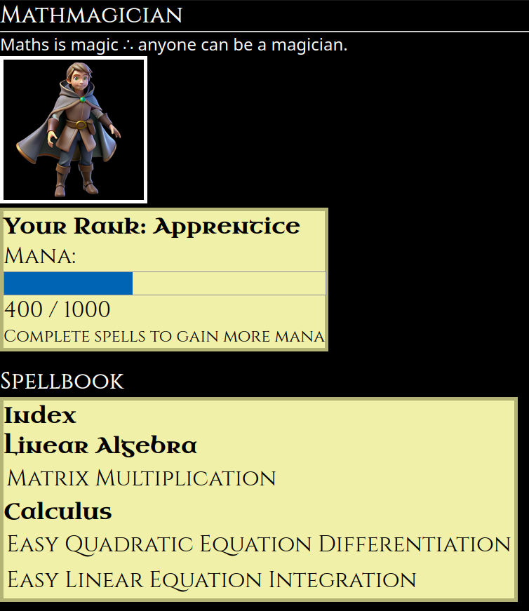

# The White Room
> An all-in-one Self Management Framework

Live Demo: http://46.101.90.169:5000/dashboard

<!--
Has features for calories and macro tracking, water tracking, kitchen inventory tracking (Product details including calories and macros per serving and per 100g and price and purchase location and price per item and servings per item and whether it is a tool or not also it generates a shopping list based on what you have in your inventory and saved products), recipe saving using saved products (not very good yet but it's not done), task management with name, description, and due dates as well as marking as complete or incomplete, self reward system with rewards, punishments, and log entries that don't affect coin balance, interval timers page that allow you to add multiple timers for different breaks, multi user chore management system with steps for the chores and RRULEs for repetition of the chores (work in progress, needs a GUI for generating the RRULEs behind the scene for you), settings page to change saved user data from initial setup page. 


# Mathmagician
Makes practice questions for you and tests you on them.
Maths is magic ∴ anyone can be a magician.

## Features  
- Matrix Multiplication questions and answers  
- Easy Quadratic Equation Differentiation questions and answers  
- Save stats (attempts, successes) and reset stats buttons  
- Separate stats for each exercise  
- Spellbook design, with index page for different maths  
- User gains Mana for completing questions and can Rank up to different levels  
- Flash notifications when completing questions or when ranking up which also shows current mana progress  
- Different "player models" for different ranks (apprentice.png, etc)  
### Possible Updates/TODO:  
- Daily streak bonus xp, logarithmic increase  
- Rank up animations  
- Gamified Experience with story telling and RPG elements  
- Show XP bar increasing animation when completing questions  
- Graph tracking progres over time  
- KaTeX rendering https://katex.org/  
- Hint levels up to the fully explained working out with the numbers used in the question  
- Speed arithmetic questions for rapid incantation-less casting  
- Flash mental arithmetic questions  
- Scratch pad area for notes and drawing  
- On screen calculators (different types depending on the questions/level/grade basic->scientific->graphing->idk all based on Casio recommended in England)  

- Think of more features and integrate with "Routes" to add a custom route learn maths from the foundations up to A-Level (high school) level)
- Check if mathmagician_base and base html templates can be merged in some way to not have two base templates or any missing features.
- Make real art for the different ranks and make rank ups based on quizzes to prove you learnt all pre requisites and can move up (also linked with route)


# Kirinify
A comfy, autumn themed music player ~~which stores songs locally AND on the server it's hosted on, therefore it works offline. Furthermore you can modify the metadata of the music files (such as genre,artist,album name, release date, etc...).~~ Also you can add tags to group them, ~~and modularly create playlists~~ for example you might have a tag for My Little Pony music and another tag for fast-paced songs then you can on the spot create a song ~~queue~~ list comprised only of MLP songs that are also fast-paced (or a specific genre, mood, etc tags are fully customisable).
No queue is not a bug it's a feature actually, it's MINDFUL COMPUTING you have to pick each song to listen to one at a time and will be present while listening to them. 
## Features
- Forget NodeJS, this project uses No JS  
- Comfy Autumn theme  
- Save music files to server if they don't already exist  
- List all music files  
- Actually play music files  
- Save song details to DB  
- Save added tags to DB  
- Delete songs  
- Display and delete all tags  
- Filter songs by tags using an OR mode or ALL mode in which it must have either any of the tags or all of the tags 
- .zip file download of all files  
- Download individual songs   

### Planned Features
- Visible name different from file name  
- Rename songs  
- Pagination or Infinite Scroll  
- Search for songs by name  
- Filter songs by name AND tags  
- Store ## Features
- Forget NodeJS, this project uses No JS  
- Comfy Autumn theme  
- Save music files to server if they don't already exist  
- List all music files  
- Actually play music files  
- Save song details to DB  
- Save added tags to DB  
- Delete songs  
- Display and delete all tags  
- Filter songs by tags using an OR mode or ALL mode in which it must have either any of the tags or all of the tags 
- .zip file download of all files  
- Download individual songs   

### Planned Features
- Visible name different from file name  
- Rename songs  
- Pagination or Infinite Scroll  
- Search for songs by name  
- Filter songs by name AND tags  
- Store upload date, file size, and duration  
- Sort/Filter by upload date, file size, and duration  
- Delete all songs with a certain tag  
- Frontend.  
- Make tags not be case sensitive

- Built in archive button to "delete" songs you don't like anymore (can be undone).  
- Modify metadata of those files (to change genre and other song details)  
- Be able to compress songs to lower quality versions  
- Built in A B testing to see if you can actually tell the difference between compressed and non compressed versions  
- Support streaming from cloud services and other websites (for example: youtube, onedrive, dropbox etc...)


Require JS, implement as Userscript in Violentmonkey?
- Create a music queue and allow you to select multiple songs and add to the queue  
- Add all song
- As with a certain tag to queue (aka create playlists)  
- Add all songs with multiple tags to queue (songs with tag1 AND tag2 only)  
-->


# Features
## Week 14 - Anything
Actually done:
- Update README <-- most important fr
- Add Mathmagician with updated theming
- Add Kirinify

To-Do:
- Improve Kitchen Inventory so that you can add an item to inventory without saving it's product details just add it once, you might've bought something just to try it once or got it as a gift from someone else.
- Update Kirinify CSS
- Fix README including adding media tracker or merging it if it already exists: "This allows you to set a specific time to play and watch what you want to watch."
- Write readme for new feature idea: RSS client that allows you to view the content with your own custom css (this probably already exists) BUT the innovation is that you can mark the blog or website or whatever it is, as a contact you know and then it will add buttons for you to contact them such as phone number or email or session or simplex or xmpp and you can add none or all or juts one of those as the contact details you have for that person and if they blogpost you can easily contact them, this is like social media but not bad for you (decentralised since it just uses rss that you have to subscribe too and they can self host) and xmpp and email are decentralised and can be encrypted too.
- Write readme for new feature idea: Content tracker that supports games, film and tv and shows and yt(rss so you don't have to make an account and yt-dlp so it can download the videos for you to watch them with no ads without needing to use command line to do it manually and this way you can customise the frontend too, add custom user css feature), twitch and other live streaming platforms (if possible tell you when they are live or when you expect them to be live and add it to schedule feature so you check if they are live or not) 
- Update journal section if I added it or if not write that readme section: Journal that can be used like obsidian to write markdown which renders every line to markdown except when you are typing on it it shows the plaintext in the style of rendered markdown (not sure how to explain it) but every other libre alternative uses the two pane view which I don't like I prefer the minimal gui and one pane view of obsidian however it is non-free. furthermore also make it useable as a diary / journal of sorts with images too and infinite scrolling to just read it in chronological order (latest to oldest)

## Week 13 - Winter Theme:
What I actually managed to implement:
Meditation frontend incomplete with placeholder data in Python not actually added to sqlite3 database.  

Ideas:
### Meditation
A timer that supports playing custom audios at the start, end, and at **customisable** time intervals. Can also be used to make things like custom couch to 5k routines with custom voices such as TTS or anything else the user can imagine. However the namesake of the feature meditation fits the winter theme as some people suffer from seasonal affective depression and meditation can help with that, and so can the other features I am aiming to implement this week: weightlifting tracking and run tracking (using GPS data such as from a smartwatch).

### Weightlifting
Support for linear progression routines (like starting strength and routines inspired by it) as well as custom exercises and workout templates.

### Running
Support for GPS data from smart watches.
If possible it will:
- Shows where you ran assuming GPS data can do that, 
- Your pace (km/h and min/km, no option for using miles instead), 
- Heart rate if that is included in the file format
- Step count
- Distance (km only)


## Week 12 - Framework Theme:
The White Room is
> An all-in-one Self Management Framework
and the following feature is a framework to plan and do **anything** such as learn languages or instruments or even the correct watch order for a series you are watching:
### Routes
A tree of tasks, habits, routines and resources that guide the user on a self guided mastery of certain skills. The user can make any custom tree but the primary use case is for people to progressively overload skills much in the same way they would with weights in a gym. For example a "mindfulness" tree might start with a habit of 1 minute a day of meditation and a resource such as a link to a YouTube video of why you should practice meditating. This can be expanded for anything such as musical instruments, languages or chess/go/shogi, anything the user can imagine to create a plan for themselves.


What I actually managed to implement so far:
- Add route (name and description)
- Add nodes ("steps") to the routes (name, type(doesn't do anything yet), content)
- Display routes and their steps
- Delete steps
- Delete routes
As well as:
- Placeholder pages for meditation, runs and weightlifting


## Older
### Food Diary


### Kitchen Inventory


#### Food Diary Demo 2
Now that there is items in kitchen inventory you can add them to food diary

Adding it to your inventory decrements the quantity added from the amount left in your inventory.

### Recipes

Work in progress, in the future it will be able to calculate an estimation for the calories and macros of the recipe based on the details saved about the ingredients in kitchen inventory. It will also be able to just add an instance of the recipe to your inventory and from there to your food diary with those calculated calories and macros, and if you made multiple servings then you can easily add it to food diary once you eat the other serving in 3 clicks. 

### Tasks


### Self Reward System

  
Need to update logic to change "-5 coins spent" to "added 5 coins".
Not shown: Reward images

### Interval Timers
Not fully working, requires updates

### Chores


### Settings
Change data from initial setup page

<!--
## Planned
-->

## Self-Hosting Guide
install python if you don't have it  

```sh
git clone https://github.com/shania-codes/thewhiteroom  
cd thewhiteroom  

Windows: python -m venv venv  
macOS/Linux: python3 -m venv venv  


Windows: 
venv\Scripts\activate  
macOS/Linux:
source venv/bin/activate  


pip install flask python-dateutil  

flask run  
```
Visit: http://YourServerIP:5000/  
